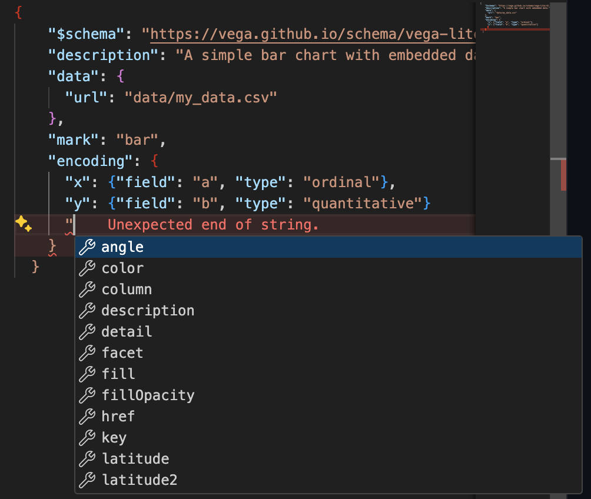
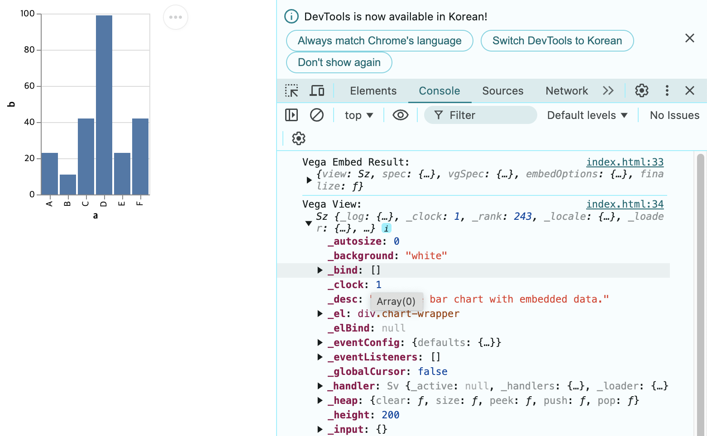

# Vega 개발 환경 설명 

## 0. 사전에 알아두면 좋은 개념
1. **HTML 기본 구성**  
   웹페이지를 만드는 데 사용하는 언어입니다. `<head>`는 페이지 설정, `<body>`는 화면에 보이는 내용을 담습니다. `<script>`는 JavaScript 코드를 삽입하는 데 사용됩니다.

2. **CDN**  
   Content Delivery Network의 약자로, 외부 서버에서 필요한 파일(예: Vega 라이브러리)을 가져오는 방법입니다.

3. **JSON**  
   데이터를 저장하고 주고받는 데 사용하는 간단한 형식입니다. 예를 들어, `{"name": "John", "age": 30}`처럼 데이터를 표현합니다.

4. **JavaScript의 fetch 함수**  
   데이터를 가져오기 위해 사용하는 기능입니다. 웹사이트에서 데이터를 불러오는 데 자주 사용됩니다.

5. **[vega-embed](https://github.com/vega/vega-embed)**  
   Vega 그래프를 쉽게 웹페이지에 표시할 수 있도록 돕는 도구입니다.

6. **[Vega View API](https://vega.github.io/vega/docs/api/view/)**  
   Vega 그래프를 JavaScript로 제어할 때 사용하는 도구입니다.

7. **웹브라우저 개발자 도구**  
   F12를 누르면 열리는 도구입니다. 웹페이지의 코드를 보고 문제를 찾거나 실행 중인 코드를 확인할 수 있습니다.
<br>

## 1. Vega 시각화의 폴더와 파일 구조

Vega 시각화를 이용한 하나의 그래프는 하나의 폴더로 관리되며 필요 파일과 폴더 구성은 다음과 같습니다. 

``` 
└── template (main folder)
    ├── data
    │   └── 데이터 파일
    ├── vega
    │   └── vega 관련 라이브러리 파일
    ├── index.vl.json
    └── index.html
```      
각 폴더와 파일에 대한 설명은 다음과 같습니다. 

- **`data` folder**  
  시각화에 사용할 데이터를 저장하고 불러오기 위한 폴더입니다. 파일 형식은 CSV, JSON 등 Vega가 지원하는 모든 형식이 가능합니다.

- **`vega` folder**  
  Vega와 관련된 JavaScript 파일이 저장되어 있습니다. 이는 `vega`, `vega-lite`, `vega-embed`의 기능이 구현된 JavaScript파일을 포함합니다. 인터넷이 연결된 경우에는 이 폴더를 사용할 필요가 없고 대부분의 경우 이 폴더를 수정할 일은 없습니다. 

- **`index.vl.json` file**  
  Vega-Lite 시각화의 설정(Spec)을 담은 JSON 파일입니다. 시각화의 종류, 데이터 바인딩, 축 설정, 스타일 등을 지정합니다.

- **`index.html` file**  
   시각화를 웹 브라우저에 렌더링하기 위한 HTML 파일입니다. Vega-Lite 라이브러리를 로드하고 index.vl.json 파일을 읽어들여 시각화를 생성합니다.
<br>


## 2. 구성 요소 상세 설명 

### 2-1. `data` folder
시각화에 필요한 데이터를 저장합니다. Vega가 지원하는 어떤 형식도 가능합니다. 일반적으로 `index.vl.json`에서 다음과 같이 `url`로 정의하여 불러옵니다. 
```json
"data": {
  "url": "data/my_data.csv"
}
```

### 2-2. `index.vl.json` 
시각화에 필요한 Vega-Lite 스펙을 작성한 JSON파일입니다. VSCode 에서 JSON에 `$schema`가 등록되어 있으면 인텔리센스나 벨리데이션이 작동하여 좀 더 쉽게 Vega-Lite Spec을 작성할 수 있습니다. 아래는 예시이며 encoding property에 정의된 항목에 대한 자세한 설명은 [vega-lite docs](https://vega.github.io/vega-lite/docs)를 참조하세요.  

```
{
  "$schema": "https://vega.github.io/schema/vega-lite/v5.json",
  "description": "An enhanced bar chart with multiple encodings.",
  "data": {
    "url": "data/my_data.csv"
  },
  "mark": "bar",
  "encoding": {
    "x": {
      "field": "a",
      "type": "ordinal",
      "axis": {
        "title": "Category",
        "labelAngle": 0
      }
    },
    "y": {
      "field": "b",
      "type": "quantitative",
      "axis": {
        "title": "Value",
        "grid": true
      }
    },
    "color": {
      "field": "c",
      "type": "nominal",
      "legend": {
        "title": "Subcategory",
        "orient": "top"
      }
    },
    "tooltip": [
      {
        "field": "a",
        "type": "ordinal",
        "title": "Category"
      },
      {
        "field": "b",
        "type": "quantitative",
        "title": "Value"
      },
      {
        "field": "c",
        "type": "nominal",
        "title": "Subcategory"
      }
    ],
    "opacity": {
      "field": "importance",
      "type": "quantitative",
      "scale": {
        "domain": [0, 1]
      },
      "legend": {
        "title": "Importance"
      }
    },
    "size": {
      "field": "frequency",
      "type": "quantitative",
      "scale": {
        "range": [10, 100]
      },
      "legend": {
        "title": "Frequency"
      }
    }
  }
}
```

Vega-Lite 스펙을 HTML안에 작성할 수도 있으나 인텔리센스(IntelliSense: 코드를 빠르고 정확하게 작성하도록 돕는 자동 완성 기능)와 밸리데이션(Validation: 코드가 규칙과 스펙을 잘 따르고 있는지 확인하는 오류 감지 기능)을 활용하기 위하여 JSON으로 분리하였습니다. 항상 이 방식에 기반해 코드 작성할 것을 추천합니다. 
다음은 코드 작성 시 IntelliSense의 예시입니다. 



### 2-3. `index.html` 
`index.html` 파일은 실제로 Vega 그래프를 실행하고 보여주는 역할을 합니다. 다음과 같은 구조로 작성됩니다:

1. **HTML 헤더에서 라이브러리 로드**     
`<head>` 테그에서 실제 Vega 렌더링에 필요한 기능을 로딩합니다.
인터넷이 연결된 경우 CDN 주소에서 로딩하지만 인터넷이 없는 환경의 경우 `vega` 폴더 다운받은 파일을 로드하면 됩니다. 

   ```html
     <head>
       <title>Embedding Vega-Lite</title>
       <!-- 인터넷이 연결된 경우 아래 주석 처리된 CDN 주소를 사용하면 됩니다. -->
       <!-- <script src="https://cdn.jsdelivr.net/npm/vega@5.30.0"></script>
       <script src="https://cdn.jsdelivr.net/npm/vega-lite@5.21.0"></script>
       <script src="https://cdn.jsdelivr.net/npm/vega-embed@6.26.0"></script> -->
   
       <!-- 인터넷이 연결되지 않은 경우 로컬 파일을 사용하면 됩니다. -->
       <script src="vega/vega@5.30.0.js"></script>
       <script src="vega/vega-lite@5.21.0.js"></script>
       <script src="vega/vega-embed@6.26.0.js"></script>
   
     </head>
   ```

2. **그래프를 표시할 위치 지정**     
다음은 vega 시각화가 렌더링 될 html 요소를 정의합니다. 나중에 vega 시각화 결과가 `vis`라는 id를 가지는 `<div>`요소의 자식 요소로 렌더링 됩니다.
   ```html
   <div id="vis"></div>
   ```

3. **JavaScript로 그래프 실행**    
다음은 필요한 JavaScript를 작성합니다. 아래 예시는 최소한의 예시를 작성했습니다 (주석 참고).
   ```html
       <script>
           // JSON 파일을 로딩합니다.
           fetch('index.vl.json')
               // 로딩이 성공하면 결과를 JSON으로 변환합니다.
               .then(response => response.json())
               // JSON 변환이 성공하면 Vega Embed를 사용하여 시각화를 생성합니다.
               .then(spec => {
                   // #vid 요소에 spec을 이용하여 시각화를 생성합니다.
                   vegaEmbed('#vis', spec)
                       // 시각화 생성이 성공하면 vega-view 오브젝트 등으로
                       // 원하는 기능을 구현합니다. 일반적으로 따로 구현하는 경우는 드뭅니다.
                       // 웹 브라우저에서 개발자 도구를 이용하여 vega-view 오브젝트를 확인하면 됩니다.
                       .then(result => {
                           let view = result.view;
                           console.log('Vega Embed Result:', result);
                           console.log('Vega View:', view);
                           // Visualization was successfully created
                       })
                       // 시각화 생성이 실패하면 에러를 출력합니다.
                       .catch(error => {
                           console.error('Vega Embed Error:', error);
                       });
               })
               // JSON 변환이 실패하면 에러를 출력합니다.
               .catch(error => {
                   console.error('Error loading JSON:', error);
               });
       </script>
   ```

Vega-Spec을 렌더링하기 위해 라이브러리에서 지원하는 `vegaEmbed`를 사용합니다.


HTML속 JavaScript를 활용하는 두가지 이유가 있습니다.
1. `node.js`의 설치가 필요 없음
2. Vega-Spec을 통하여 랜더링 한 결과와 상호작용할 수 있음 (View API와 JavaScript 코드 활용해야 함)

2의 경우 직접 HTML Element나 Event를 직접 처리해서 더 강력한 상호작용을 구현할 수 있습니다 (`D3.js` 처럼).

<br>   

## 3. 사용 방법     
### 기본 사용법     
고급 사용자가 아니면 다음 사용법을 추천합니다.
1. **`template` 폴더 복사**  
   프로젝트를 시작할 때 템플릿 폴더를 복사합니다.

2. **데이터 추가**  
   `data` 폴더에 데이터를 넣습니다.

3. **설정 파일 수정**  
   `index.vl.json`에서 데이터 파일 경로와 시각화 스펙을 모두 수정합니다.

4. **결과 확인**  
    VSCode Extension인 `Live Server` 확장을 설치하고 HTML 파일을 우클릭한 뒤 `Open with Live Server`를 선택하세요. 그럼 파일이 변경된 것이 감지될 때마다 자동으로 새로고침을 수행합니다. 또한 `Live Server`에서 연 HTML은 로컬 파일을 읽을 수 있습니다. 우리의 경우 JSON과 CSV를 파일시스템에서 로딩하기 때문에 이러한 기능이 필요합니다. 
   
### 추가 팁     
1. **JavaScript 코드 작동 결과 확인**     
   브라우저에서 F12를 누르고 'Console' 탭에서 에러 메시지 등 프린트 되는 로그를 확인하세요.



